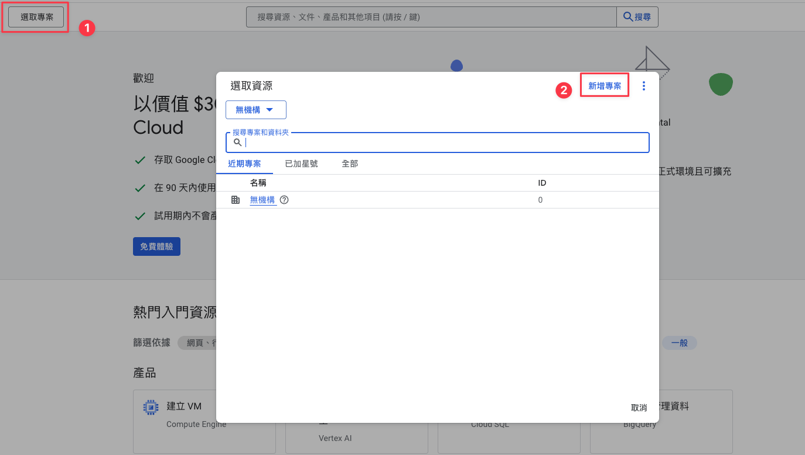
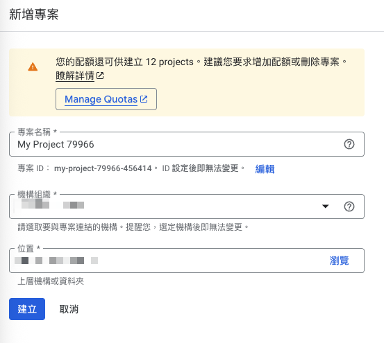
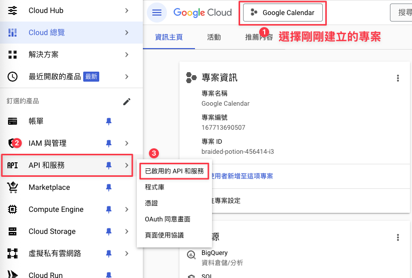
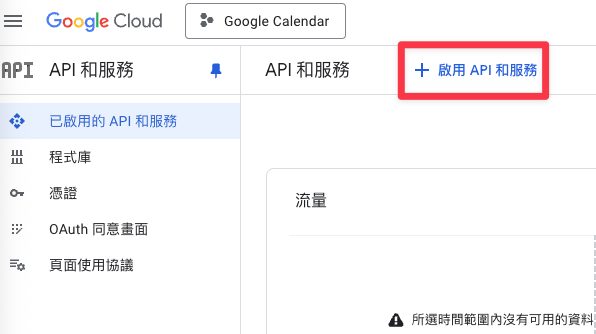
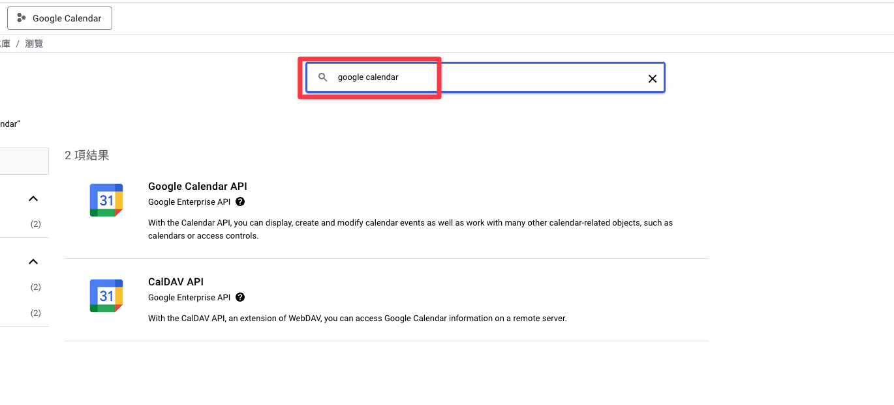
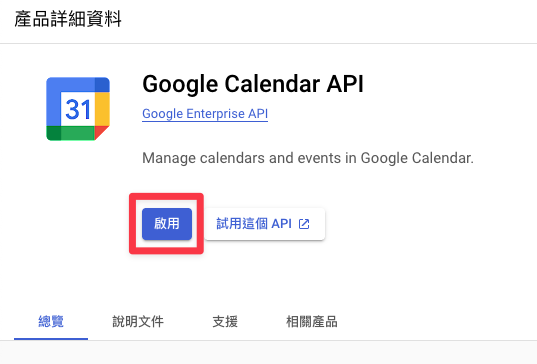
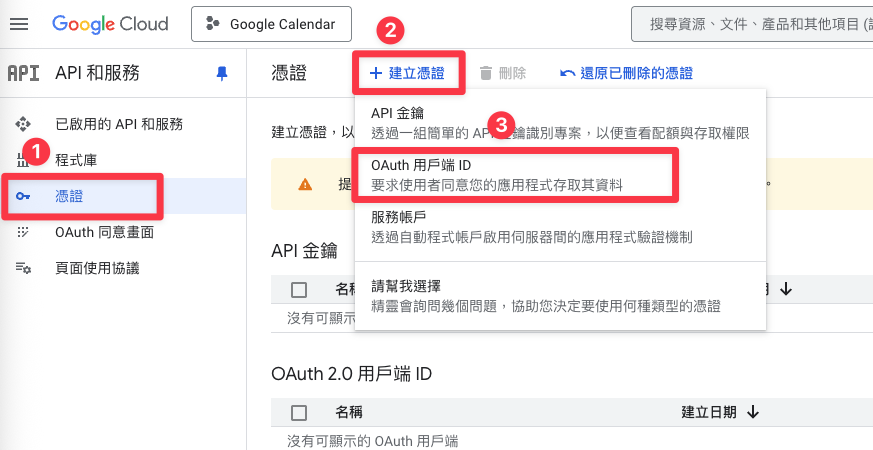
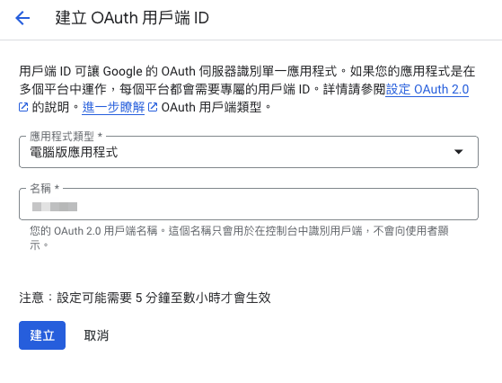
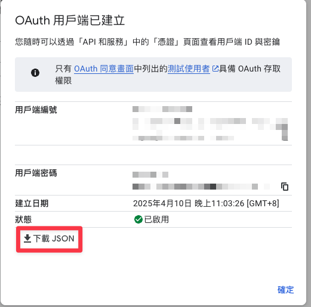
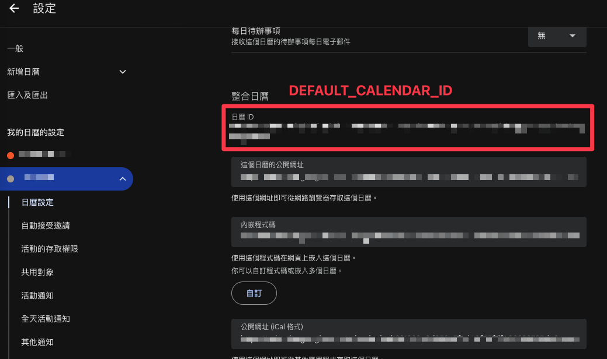

# ics_to_google_calendar

專案目錄結構如下：

```
ics_to_google_calendar/
├── app/                   # 核心應用程式邏輯
│   ├── config.py          # 專案設定檔
│   ├── main.py            # Google Calendar 同步邏輯
│   ├── parse_ics2json.py  # 下載並轉換 ICS 檔案為 JSON
│   └── run_script.py      # 執行腳本
├── data/                  # 資料與憑證檔案
│   ├── application.log    # 執行日誌檔案
│   ├── config.json        # 使用者設定檔
│   ├── credentials.json   # Google API 憑證檔案
│   ├── debug_calendar.ics # 測試用的 ICS 檔案
│   ├── events.json        # 轉換後的 JSON 格式行事曆資料
│   ├── last_synced_*.json # 上次同步的狀態檔案
│   └── token.pickle       # Google API 驗證 Token
├── Dockerfile             # Docker 設定
├── README.md              # 專案說明文件
├── requirements.txt       # 相關套件
└── screenshot/            # 截圖資源
```
## 1. 設定 Google API 認證
在使用前，你需要設定 Google API 認證：

- 前往 Google Cloud Console (https://console.cloud.google.com/welcome/new)
- 建立一個專案並啟用 Google Calendar API













- 建立 OAuth 憑證，選擇桌面應用程式類型





- 下載憑證檔案並重命名為 credentials.json，放在 data 資料夾下



## 2. 設定檔案

請根據需求編輯 `data/config.json`，設定以下參數：

- `ICS_URL`：ICS 檔案的下載 URL。
- `DEFAULT_CALENDAR_ID`：Google Calendar 的 ID。



## 手動執行 script

``` bash
python run_script.py
```

## 使用 Docker

### 1. 建立 Docker 映像

在專案目錄中執行以下指令：

```bash
docker build -t itri_calendar .
```

### 2. 執行容器 (可搭配 crontab 排程執行)

```bash
docker run --rm -v $PWD/data:/app/data ics_to_google_calendar
```

## 日誌檔案

所有執行過程的日誌會記錄在 `application.log` 中，包含以下資訊：

- 事件新增、更新、刪除的狀態。
- 錯誤訊息與詳細堆疊。

## 常見問題

### 1. 如何處理 Google Calendar API 的 409 Conflict 錯誤？

如果事件的 event_id 重複，請確保：

- 手動刪除的事件已從 Google Calendar 中完全移除。
- 清空 `last_sync` 檔案，重新同步。

### 2. 如何清空 `last_sync` 檔案？

執行以下指令刪除 `last_sync_*.json` 檔案：

```bash
rm last_sync_*.json
```

## 貢獻

歡迎提交 Issue 或 Pull Request，協助改進此專案。

## 授權

此專案採用 MIT 授權條款。
